# RenderDoc — 打造自己AI工作流
#renderdoc #ai #mcp
---

## 目录

- [RenderDoc — 打造自己AI工作流](#renderdoc--打造自己ai工作流)
  - [#renderdoc #ai #mcp](#renderdoc-ai-mcp)
  - [目录](#目录)
  - [1.前言](#1前言)
  - [2.效果展示](#2效果展示)
    - [2.1渲染流程](#21渲染流程)
    - [2.2GPU地形系统](#22gpu地形系统)
    - [2.3光照计算](#23光照计算)
    - [2.4自动导入Unity](#24自动导入unity)
  - [3.简单介绍MCP](#3简单介绍mcp)
  - [4. 安装RenderDoc MCP](#4-安装renderdoc-mcp)
    - [4.1安装环境](#41安装环境)
    - [4.2安装扩展](#42安装扩展)
    - [4.3安装MCP服务端](#43安装mcp服务端)
    - [4.4配置AI MCP](#44配置ai-mcp)
  - [相关链接](#相关链接)

---

## 1.前言

自写这个文章([RenderDoc食用姿势](https://zhuanlan.zhihu.com/p/686281571))以来，已经发生了翻天复地的变化，现在在AI加持下已经可以快速的分析还原了，全部都可以自动化。具体做法是AI + RenderDoc MCP就可以了，好了此文已终结。

**GitHub项目地址**: https://github.com/halby24/RenderDocMCP

下面就开始水文章了....

文章配图在这: https://github.com/Straw1997/Document/tree/main/%E7%9F%A5%E4%B9%8E/RenderDoc-%E6%89%93%E9%80%A0%E8%87%AA%E5%B7%B1AI%E5%B7%A5%E4%BD%9C%E6%B5%81

---

## 2.效果展示

我们就以这帧终末地为例，我是用的AI是augment的sonnet4.6

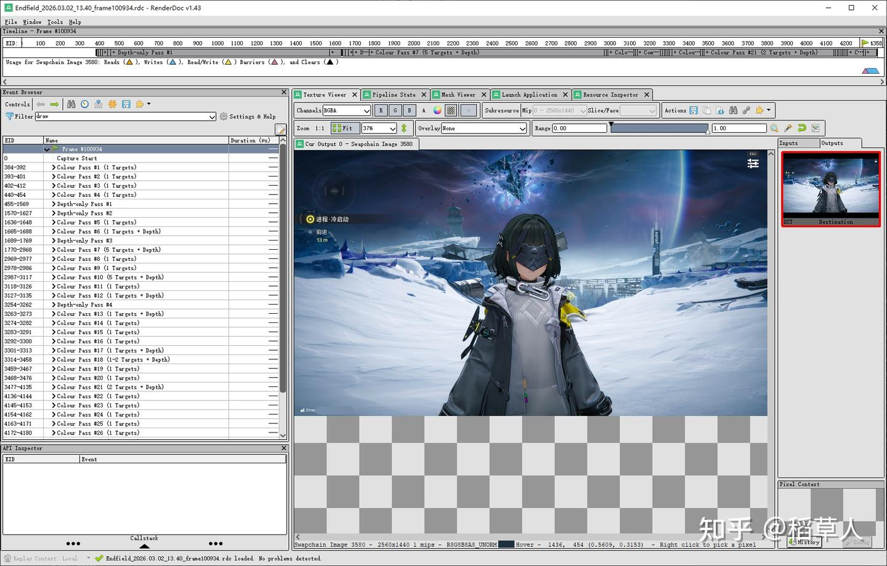

### 2.1渲染流程

可以直接让AI绘制这帧的大概渲染流程。

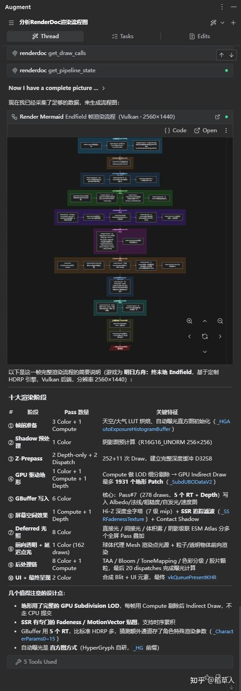

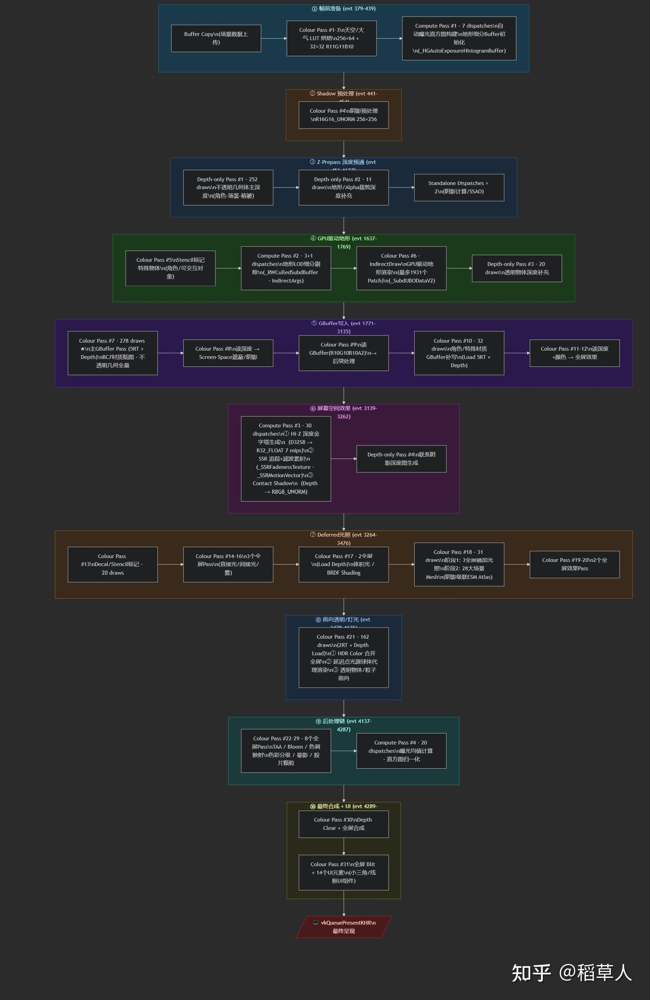

### 2.2GPU地形系统

还可以让他分析某个效果所使用到的技术，例如GPU地形系统

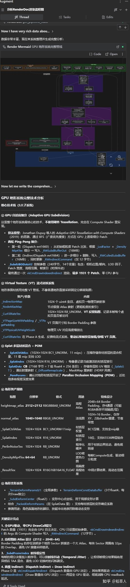

### 2.3光照计算

还可以让他反编译shader，直接提取光照计算的具体公式流程

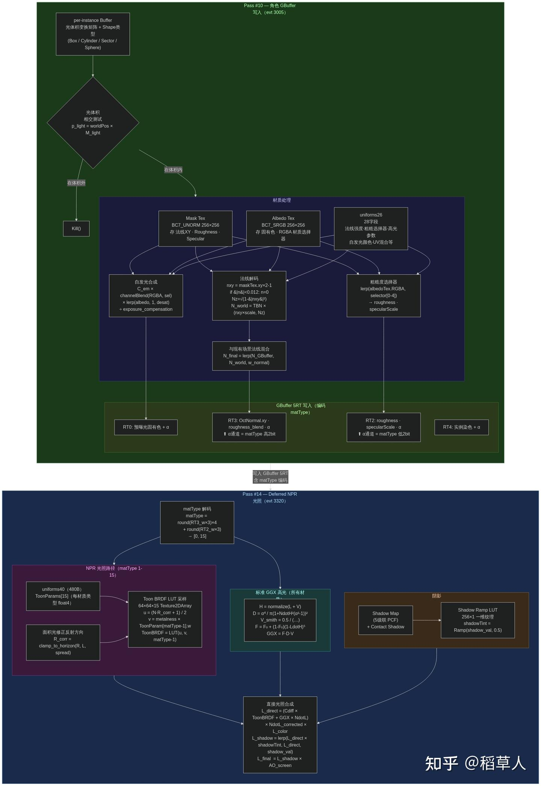

### 2.4自动导入Unity

另外我们还可以安装unity mcp，让AI直接导出角色渲染相关依赖的资产，导入到unity中反编译相关shader，在unity中创建对应的urp shader，并创建材质，给上对应的贴图和参数，再把角色放到场景中，可谓是一条龙服务。

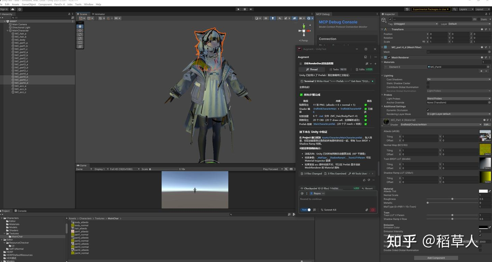

经过漫长的等待，第一次导出是这样的，一些shader是写出来了，但是贴图啥的给的有问题，后面让他进行检查修改。

后面又试了几次，可能选的范围太大了，中间穿插了一些其他模型，还有外描边之类的，就先这样把，积分花的我肉疼....

---

## 3.简单介绍MCP

在安装这些之前我们先了解下MCP是什么

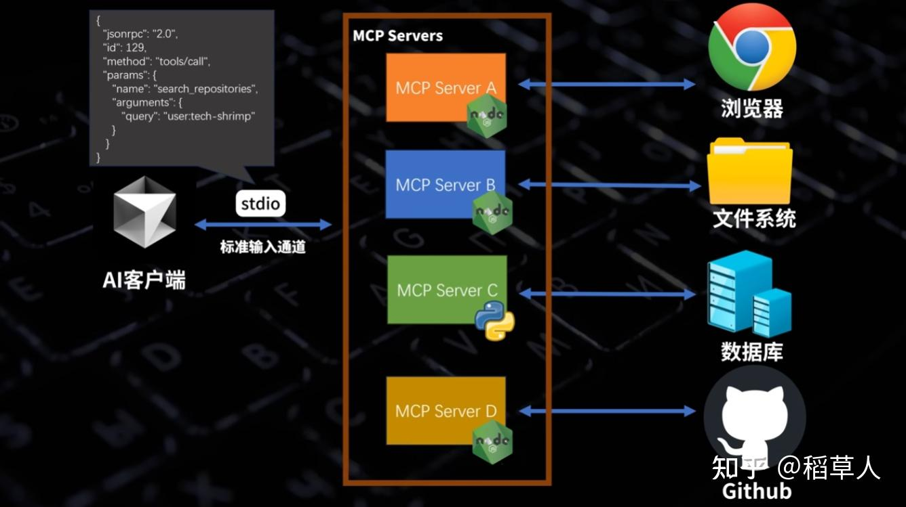

图片截取自: https://www.youtube.com/watch?v=McNRkd5CxFY

嗯，就是这样MCP（[Model Context Protocol](https://www.google.com/search?q=Model+Context+Protocol)，模型上下文协议)，作为AI访问其他工具的中间层，可以直接让AI去控制这些工具，也就是有了RenderDoc MCP，AI就可以控制读取RenderDoc，有了unity MCP，AI就可以控制读取unity，当然这也取决于MCP服务给开放的内容，嗯 接下来就简单了 安装这俩个MCP就好了。

所以我们安装MCP的步骤基本就是：

1. 对应工具安装插件用于控制
2. 安装对应MCP服务端进行通信
3. 对AI客户端配置MCP服务让他链接访问

---

## 4. 安装RenderDoc MCP

**GitHub项目地址**: https://github.com/halby24/RenderDocMCP

Readme已经告诉怎么安装了，但这里为了水文章，就在翻译一下

### 4.1安装环境

首先你需要python环境和Node.js，直接网站一搜安装。

然后需要安装uv，打开命令行输入，安装完后需要关闭，后面打开新的命令行

```bash
python -m pip install uv
```

### 4.2安装扩展

然后在你下载的根目录运行命令行，执行以下命令安装扩展

```bash
python scripts/install_extension.py
```

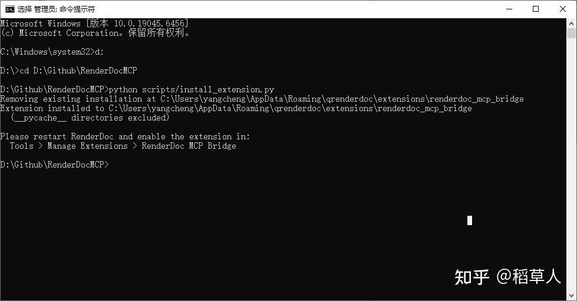

然后打开RenderDoc，打开`Tools` -> `Manage Extensions`，开启 `RenderDoc MCP Bridge`

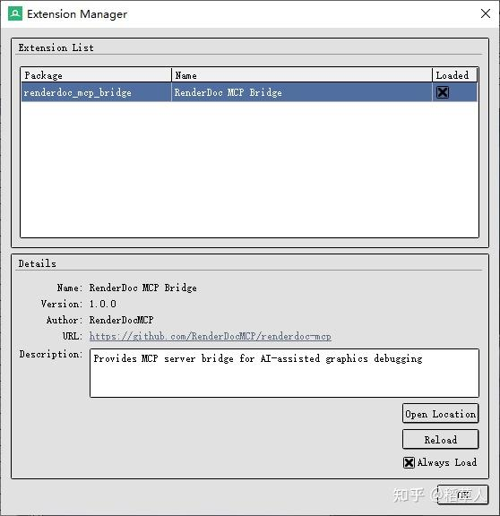

如果你是自己编译的RenderDoc，或者其他人的学习版，很有可能没有这个选项，因为他不会去AppData里去找对应的插件，需要手动进行复制

```
C:\Users\xxx\AppData\Roaming\qrenderdoc\extensions\
```

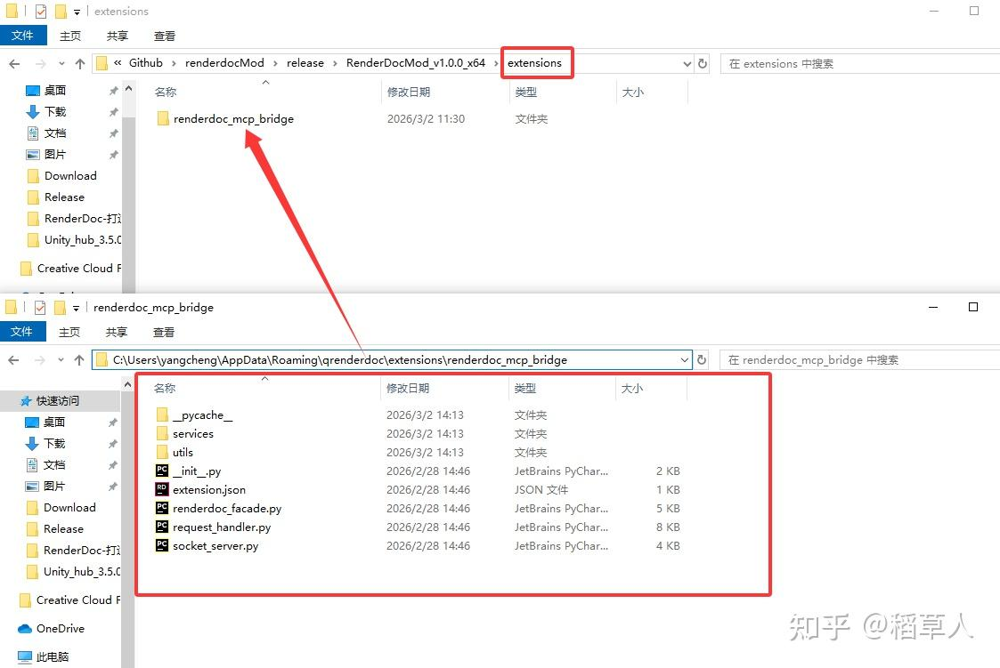

复制到renderDoc执行目录下的extensions文件夹，没有的话手动创建一下。还需要去原版的RenderDoc拷贝这两个文件PySide2、shiboken2

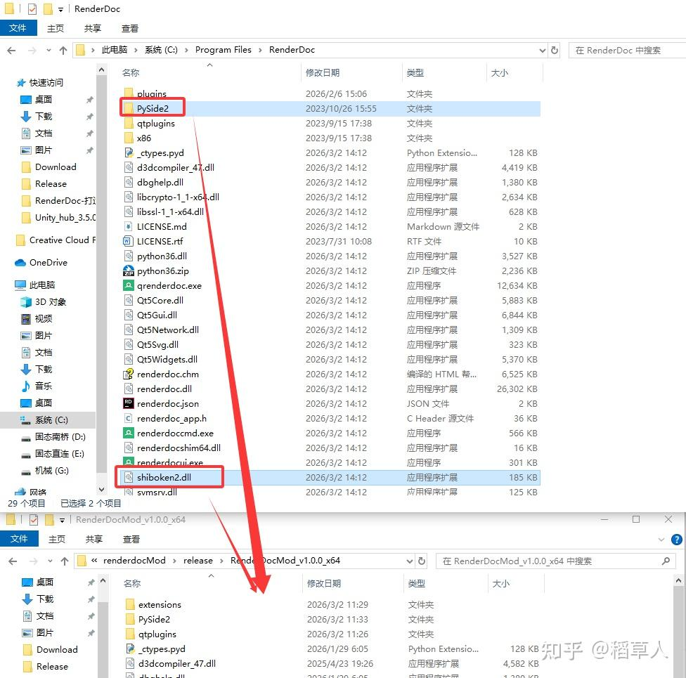

### 4.3安装MCP服务端

打开命令行cd到Github下载的那个目录，运行命令

```bash
uv tool install .
```

它会下载和编译服务端代码，并在你的系统里注册一个名为 `renderdoc-mcp` 的全局命令

### 4.4配置AI MCP

找到你的AI MCP服务，通过JSON添加。我这里使用的是Rider 的Augment插件

```json
{
  "mcpServers": {
    "renderdoc": {
      "command": "renderdoc-mcp",
      "args": []
    }
  }
}
```

如果他没有设置环境变量的话，你可以使用绝对路径，用户名那里需要改成自己的

```json
{
  "mcpServers": {
    "renderdoc": {
      "command": "C:/Users/用户名/.local/bin/renderdoc-mcp.exe",
      "args": []
    }
  }
}
```

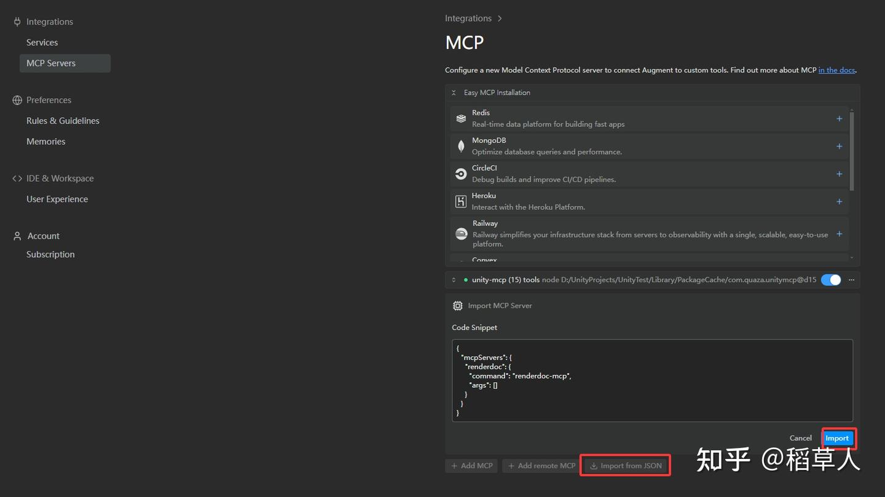

添加完成后，打开你的RenderDoc，打开之前捕获的一帧，或者开启游戏从新捕获啥的，左边的点应该会变绿表示链接成功，然后就可以快乐的用AI对他下指令了。

---

## 相关链接

- RenderDoc MCP GitHub: https://github.com/halby24/RenderDocMCP
- Unity MCP GitHub: https://github.com/quazaai/UnityMCPIntegration
- MCP介绍视频: https://www.youtube.com/watch?v=McNRkd5CxFY

---

**整理时间**: 2026-03-06  
**整理工具**: Chrome MCP + AI Assistant
