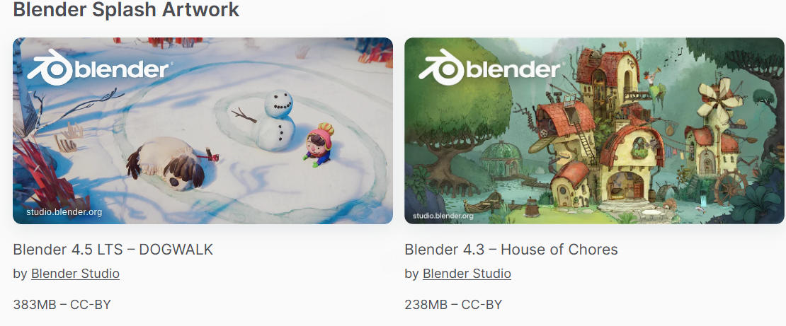
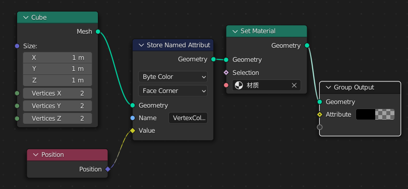
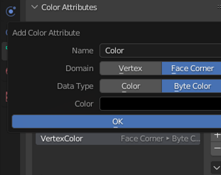
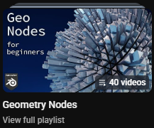
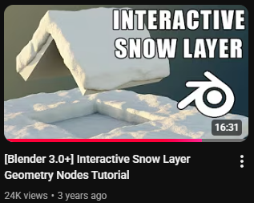
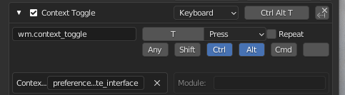

# Blender

#Blender

---

## Blender 官方工程

- Blender 源码

https://github.com/blender/blender

- Blender 官方工程下载

https://www.blender.org/download/demo-files/

---

## Blender github项目

### Blender中使用glsl创建Texture(N年前2.8项目,不知道现在还能不能用)

https://github.com/patriciogonzalezvivo/glslTexture?tab=readme-ov-file

---

## Blender Geometry Node GN

### 基本操作

#### 快捷键
- 节点Ctrl + x 可以删除的情况下保留连线
- Shift + 右键添加中间节点
- Ctrl + 右键快速切断
- alt + 右键快速链接

### Geometry Nodes 顶点色

- 注意要用byteColor 和 Face Corner

### 教程

- 不错的Geometry Nodes 教程 Geometry Nodes for Beginners

https://www.youtube.com/watch?v=szTYXk0t09A&list=PLzg4_2BrWAVzK4ORuEHz0RoE7Va3w6fBf

- MaxEdge GN 教程

https://www.youtube.com/@MaxEdge420/videos

---

## 小技巧Tips

### Blender 快速切换语言

新建个快捷键映射条目填wm.context_toggle
属性填preferences.view.use_translate_interface

---
