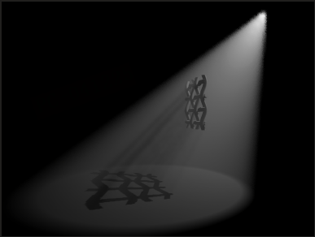
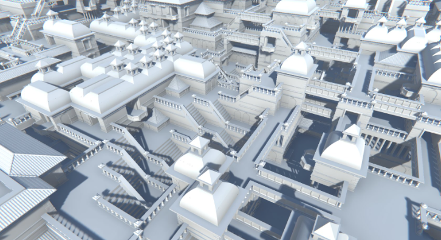
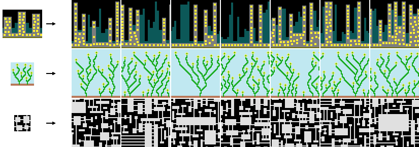
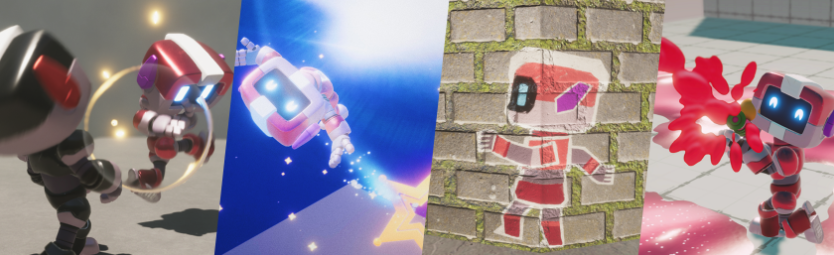
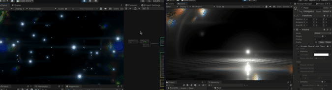
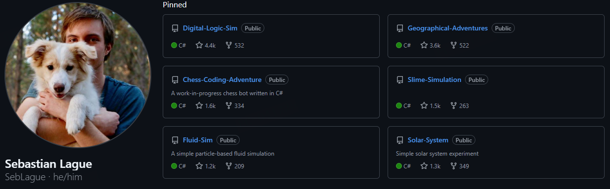
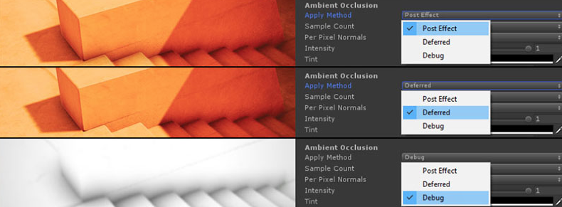
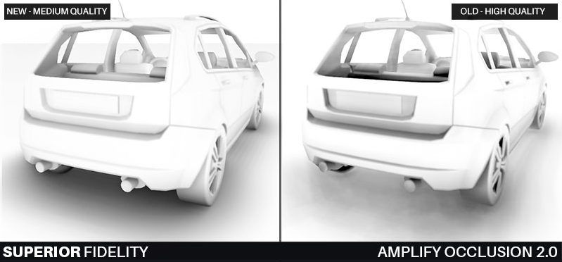
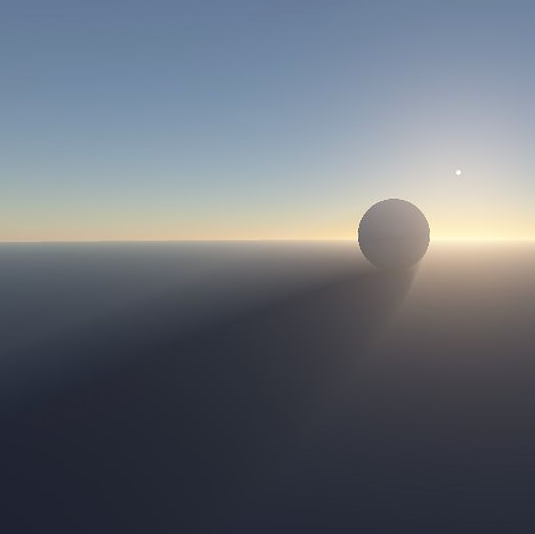
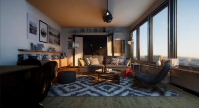

# GitHub

#GitHub

---

## 好的git项目

---

### Blender 相关

[BlenderGitHub md 文档](../Blender相关/Blender.md)

---

### Volumetric fog

https://github.com/rin-miku/SimpleVolumetricLighting

---

### 波函数坍塌

https://github.com/marian42/wavefunctioncollapse

https://github.com/mxgmn/WaveFunctionCollapse

---

### Mix and jam

https://github.com/mixandjam

---

### ScreenSpaceLensFlareTest

https://github.com/keijiro/ScreenSpaceLensFlareTest

---

### Sebastian Lague

https://github.com/SebLague

---

### GTAO (AmplifyOcclusion)

https://github.com/AmplifyCreations/AmplifyOcclusion

---

### 预积分大气散射 Brunetons-Improved-Atmospheric-Scattering

https://github.com/Scrawk/Brunetons-Improved-Atmospheric-Scattering/tree/master

---

### Cmake Tutorial (cmake-examples-Chinese)

https://github.com/SFUMECJF/cmake-examples-Chinese

https://sfumecjf.github.io/cmake-examples-Chinese/

---

### SSGI

[SSGI.md](../渲染相关/GI相关/SSGI.md)

---

