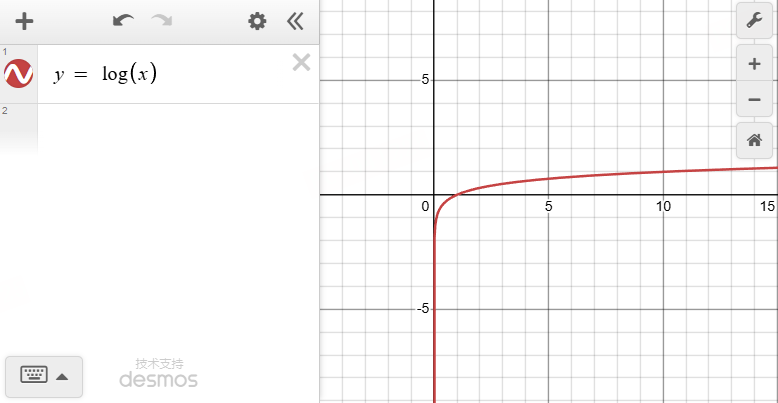
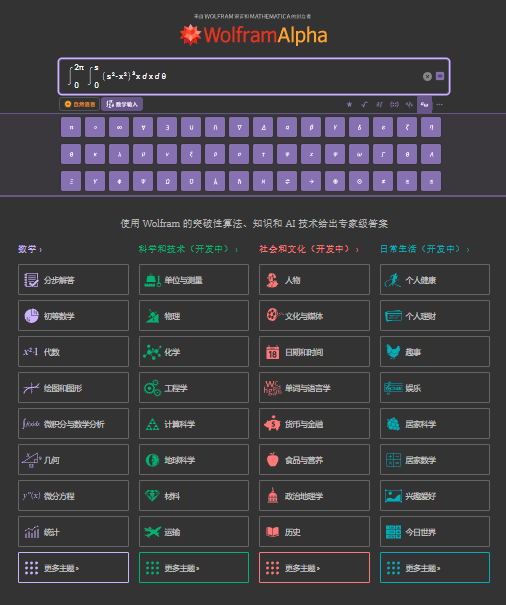
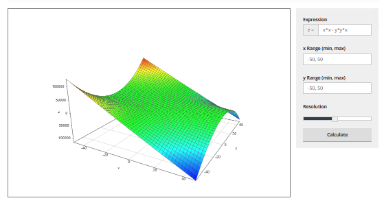

# 在线实用工具Online Tools
#tools

---

## 数学类工具Tools

### Desmos 函数可视化

https://www.desmos.com/calculator?lang=zh-CN

---
### wolframalpha 积分函数求解(可以求积分)

https://www.wolframalpha.com/

---

### Academo 2D函数可视化

https://academo.org/demos/3d-surface-plotter/?expression=x*x-y*y*x&xRange=-50%2C%2050&yRange=-50%2C%2050&resolution=48

---

### 注释生成网站

http://patorjk.com/software/taag/#p=display&h=0&f=Big&t=SDF

---