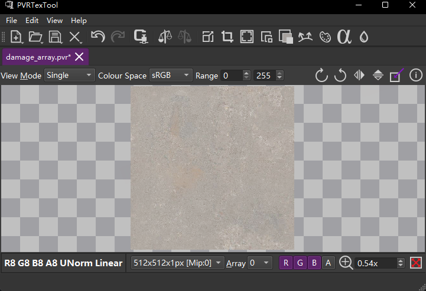
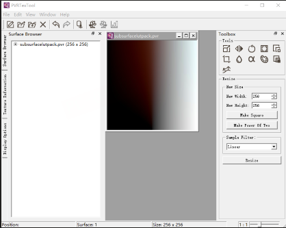
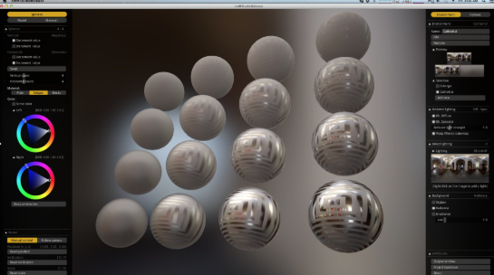
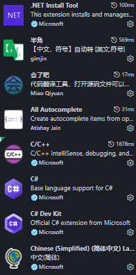
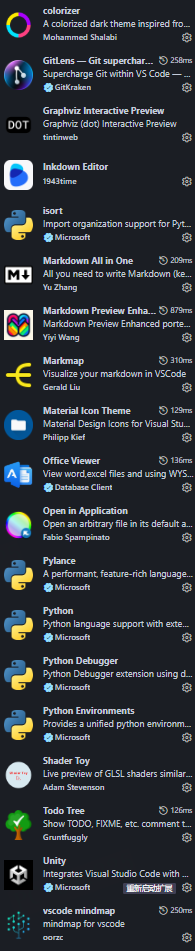
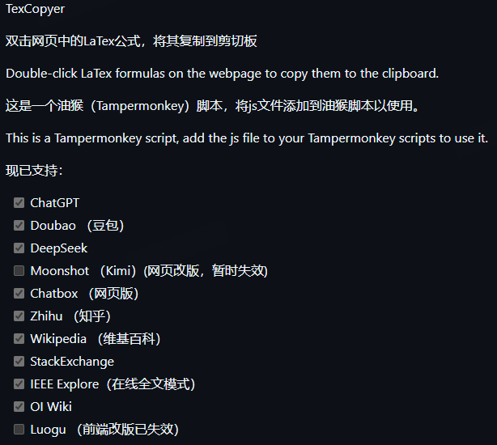

# 实用开发工具Tools

#tools

---

## Texture array

### PVRTexTool

https://developer.imaginationtech.com/downloads/

---

## cubemap cmftStudio

https://github.com/dariomanesku/cmftStudio?tab=readme-ov-file

---

## vsCode 插件

---

## 油猴脚本

### 网页复制公式 (公式上双击左键复制公式)

https://github.com/3plus10i/TexCopyer

---
