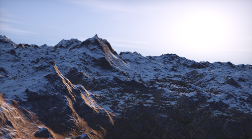
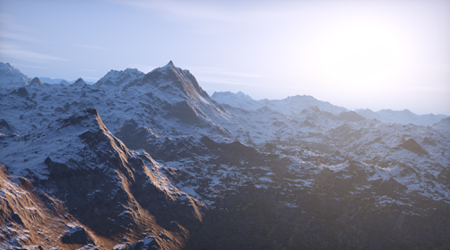
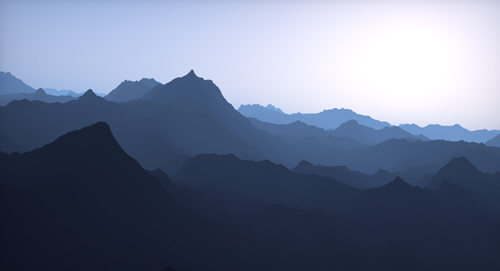
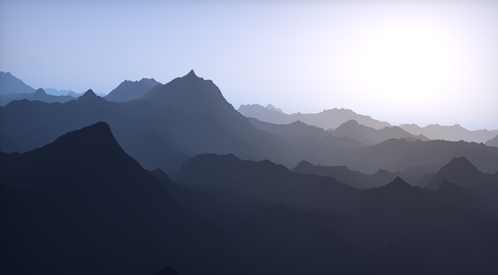
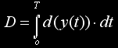
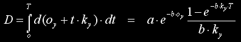
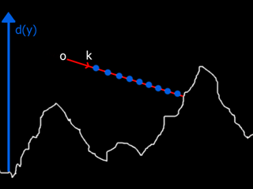
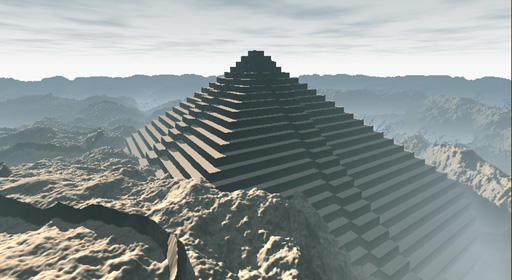
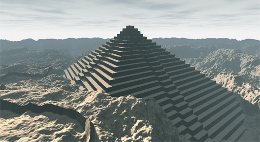
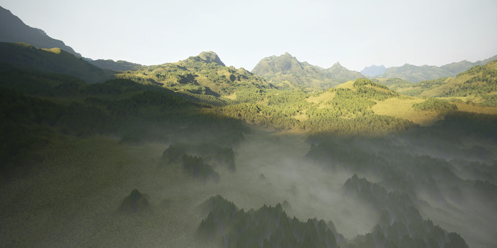

# 解析积分高度雾
#fog #解析积分

https://iquilezles.org/articles/fog/

### Intro

---

Fog is very popular element in computer graphics, so popular that in fact we are always introduced to it early in textbooks or tutorials. However these textbooks, tutorials and even APIs only go as far as a simple distance based color blending, and stop there. Even advanced demos, interactive applications and games go no further that the simple color blending. Hopefully one can do much better and introduce some extra beauty and/or realism to the images with very little additional work on top of the basic idea.  
  
  

### Colored fog

---

Traditionally fog is introduced as being the visual element that gives distance cues in an image. And indeed the fog quickly helps us understand the distances and therefore scale of objects, and the world itself.  
  


Without fog it's not easy to tell the scale of the terrain


With fog we immediately understand the size the terrain

However we should note that fog can also provide more information than that. For example, the color of the fog can tell us about the location of the sun in the sky, through variation in its hue. This also increases the realism to the image. A simple way to do this is to change the typical bluish fog color to something yellowish when the view vector aligns with the sun direction. This gives a very natural light dispersion effect. One would argue that such an effect shouldn't be called fog but scattering, and I agree, but in the end of the day one simply has to modify a bit the fog equation to get the effect done.  
  
``` cpp
vec3 applyFog( in vec3  col, // color of pixel
               in float t )  // distance to point
{
    float fogAmount = 1.0 - exp(-t*b);
    vec3  fogColor  = vec3(0.5,0.6,0.7);
    return mix( col, fogColor, fogAmount );
}
```

```cpp
vec3 applyFog( in vec3  col,   // color of pixel
               in float t,     // distance to point
               in vec3  rd,    // camera to point
               in vec3  lig )  // sun direction
{
    float fogAmount = 1.0 - exp(-t*b);
    float sunAmount = max( dot(rd, lig), 0.0 );
    vec3  fogColor  = mix( vec3(0.5,0.6,0.7), // blue
                           vec3(1.0,0.9,0.7), // yellow
                           pow(sunAmount,8.0) );
    return mix( col, fogColor, fogAmount );
}
```

vec3 applyFog( in vec3 col, // color of pixel in float t, // distance to point in vec3 rd, // camera to point in vec3 lig ) // sun direction { float fogAmount = 1.0 - exp(-t\*b); float sunAmount = max( dot(rd, lig), 0.0 ); vec3 fogColor = mix( vec3(0.5,0.6,0.7), // blue vec3(1.0,0.9,0.7), // yellow pow(sunAmount,8.0) ); return mix( col, fogColor, fogAmount ); }

  
The effect can be done much more sophisticated. For example the exponent of the dot product between the sun and view vectors (which of course controls the influence of the directional color gradient) can be varyied with distance too. With the right settings one can fake glowing/blooming and other light scattering effects without actually doing any multipass or render to texture but a simple change to the fog equation. Color can change with altitude too, or any other parameters you might think of.  
  
  

Regular monocrhome fog


Colored fog based on sun direction

  
Another variation of the technique that we can develop starts by first splitting the usual mix() command in its two parts, ie, replace  
  
``` cpp
finalColor = mix( pixelColor, fogColor, 1.0-exp(-distance*b) );
```
  
with  
  
``` cpp
finalColor = pixelColor*exp(-distance*b) + fogColor*(1.0-exp(-distance*b));
```
  
  
Then, according to classic CG atmospheric scattering papers, the first term could be interpreted as the absortion of light due to scattering or "extinction", and the second term can be interpreted as the "inscattering". We note that this way of expressing fog is more powerfull, because now we can choose independent fallof parameters _**b**_ for the extinction and inscattering. Furthermore, we can have not one or two, but up to six different coefficients - three for the rgb channels of the extintion color and three for the rgb colored version of the inscattering.  
  
``` cpp
vec3 extColor = vec3( exp(-distance*be.x), exp(-distance*be.y) exp(-distance*be.z) );
vec3 insColor = vec3( exp(-distance*bi.x), exp(-distance*bi.y) exp(-distance*bi.z) );
finalColor = pixelColor*(1.0-extColor) + fogColor*insColor;
```
  
  
This way of doing fog, combined with the sun direction coloring and other tricks can give you a very powerfull and simple fog system, yet very compact and fast. It's also quite intuitive, and you don't have to deal with tons of physics, maths and magic constants for Mie and Rayleight spectral constants and stuff. Simple and controlable is the win.  
  
  

### Non constant density

---

The original and simple fog formula has two parameters: the color and the density (which I called _**b**_ in the shader code above). Same way we modified it to have non constant color, we can also modify it so it doesn't have constant density. I'm gonna follow Crytek's trick in this one, but you can play and get some cool results with your own formulas too, although the derivation in that case might be a bit more complex.  
  
Real atmosphere is less dense in the height athmosphere than at the sea level. We can model that density variation with an exponential. The good thing of the exponential function is that the solution to the formulas is analytical. Let's see. We start with this exponential density function, which depends on the height _**y**_ of our point:  

$$
d(y) = a⋅e^{-b⋅y}
$$
  
The parameter **_b_** controls, of course, the fallof of this density. Now, as our ray traverses the atmosphere from the camera to the point, it will be accumulating opacity as it traverses the athmosphere. The amount of fog it gathers in each of these infinite amount of infinitelly little steps is driven by the fog density (that we just defined) at those points. So we have to add them all together. But of course, adding an infinte amount of ridiculosuly small things is called "integral" in maths. So, given our ray  
  
$$
r(t) = o_y + t⋅k_y  
$$
  
we have that the total amount of fog is  
  

  
where _**T**_ is the distance from the camera to the point. This integral can be solved analytically, giving  
  

  
so that our non-constant-density-fog shader is  

vec3 applyFog( in vec3 col, // color of pixel in float t, // distnace to point in vec3 ro, // camera position in vec3 rd ) // camera to point vector { float fogAmount = (a/b) \* exp(-ro.y\*b) \* (1.0\-exp(-t\*rd.y\*b))/rd.y; vec3 fogColor = vec3(0.5,0.6,0.7); return mix( col, fogColor, fogAmount ); }

  
which means that by adding no more than one division to the original formula we can get some cool height based fog (note that the rest of the formula is constant for a given frame).  


The integral of the fog density function d(y) over the ray gives the final amount of fog

  
  

Note low altitude parts get extra fog


Without height based fog

  
Again, there are many variations that one can add to this constanst-vertical-exponential-fallof-density-function shader.  
  

A raymarched terrain with non constant fog density  
  
  

[inigo quilez](https://iquilezles.org) - learning computer graphics since 1994
