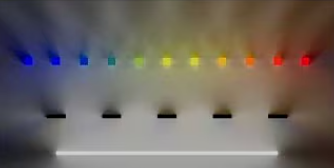
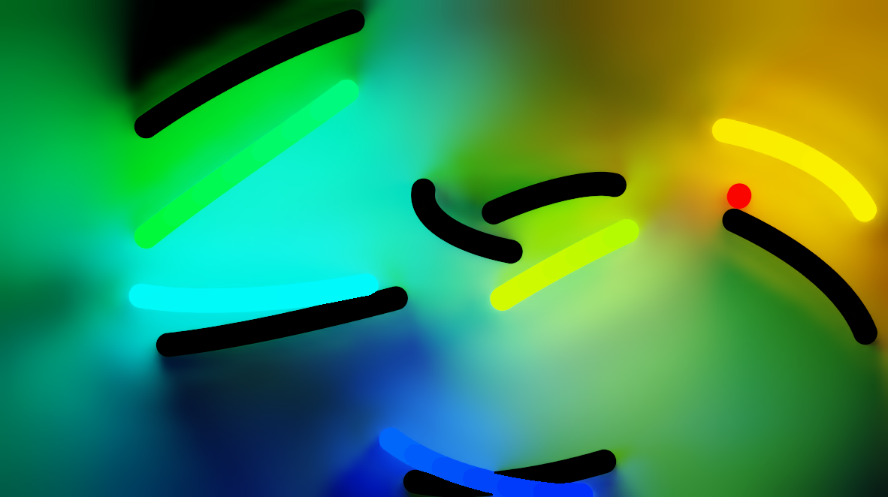

# RadianceCascades - A Novel Approach to Calculating Global Illumination
#GI

---

### Exploring a New Approach to Realistic Lighting: Radiance Cascades

https://www.youtube.com/watch?v=3so7xdZHKxw

https://tmpvar.com/poc/radiance-cascades/

https://www.shadertoy.com/view/mlSfRD

### 相关paper名称
Radiance Cascades: A Novel Approach to Calculating Global Illumination[WIP]
