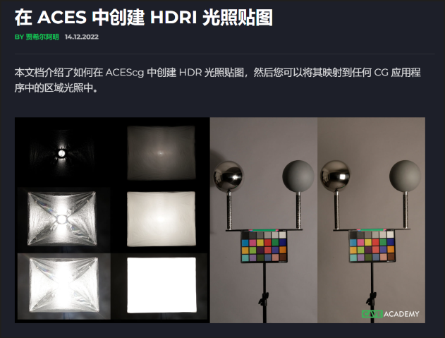
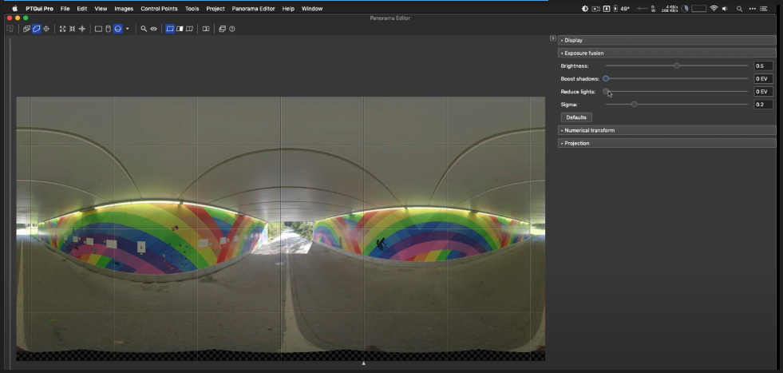

# LookDev
#hdr #lookdev

---
## PTGui

### LookDev PTGui 处理HDR贴图 ACES

https://caveacademy.com/wiki/onset-production/data-preparation/creating-a-hdri-light-map-in-aces/

### PTGui tutorial part 5: stitching HDR panoramas

https://www.youtube.com/watch?v=xuuZipXZscM

