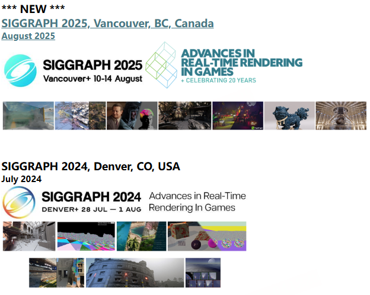
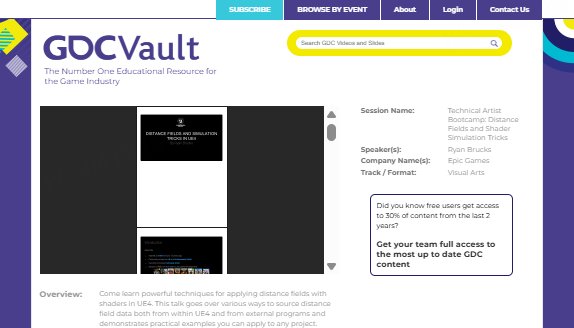
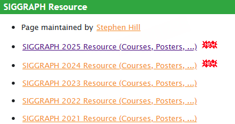
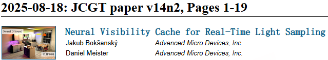
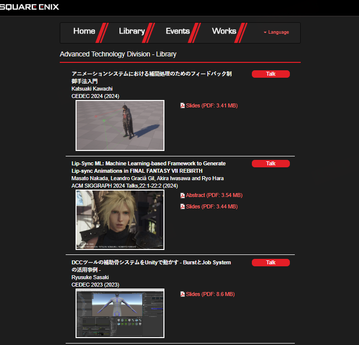
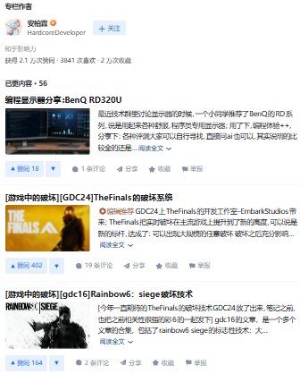
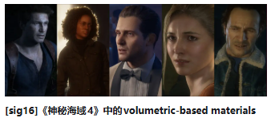

# Paper网页链接
#paper #渲染 #siggraph #GDC

---

## 原始Paper

### Advances in Real-Time Rendering in Games

https://advances.realtimerendering.com/

---

### GDC Vault

https://www.gdcvault.com/play/1026262/Technical-Artist-Bootcamp-Distance-Fields

---

### Ke-Sen Huang's Home Page

https://kesen.realtimerendering.com/

---

### the Journal ofComputer Graphics Techniques

https://jcgt.org/

---

### 最终幻想paper

https://www.jp.square-enix.com/tech/publications.html#

---
---

## Paper解析

### 安柏霖gamedev 知乎渲染paper解析

https://zhuanlan.zhihu.com/anbailin-gamedev

---

### [sig16]《神秘海域4》中的volumetric-based materials

https://zhuanlan.zhihu.com/p/50249866

---
---

