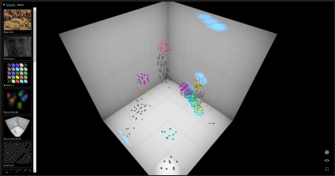
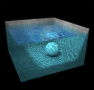
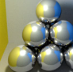
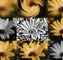
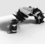

# 几个比较好的WebGL项目
#webgl #shader

---

## Google swissgl WebGL

https://github.com/google/swissgl

https://google.github.io/swissgl

---

## Evan Wallace WebGL Graphics

https://madebyevan.com/

### WebGL Water (2010)

This project was an experiment in realtime water rendering with WebGL. The focus was on the rendering aspect, not on the simulation, so the behavior of the water isn't that realistic. The water heightfield is simulated using a floating-point texture and the caustics are rendered using the GLSL derivative functions.

[View demo...](/webgl-water/)

### WebGL Path Tracing (2010)

Path tracing is a realistic lighting algorithm that simulates light bouncing around a scene. This path tracer uses WebGL for realtime performance and supports diffuse, mirrored, and glossy surfaces.

[View demo...](/webgl-path-tracing/)

### WebGL Image Filters (2011)

Adjust your photos in your browser in realtime with ten different image filters. This uses WebGL for speed, is entirely client-side, and is [open source on GitHub](https://github.com/evanw/webgl-filter). It was coded from scratch in 24 hours for HackNY, a hackathon in NYC, where it won second place.

[View demo...](https://evanw.github.io/webgl-filter/)

### Shader Articles (2015)

A collection of interesting bits of shader code. All demos use WebGL and run in all major browsers.

[View demos...](/shaders/)
